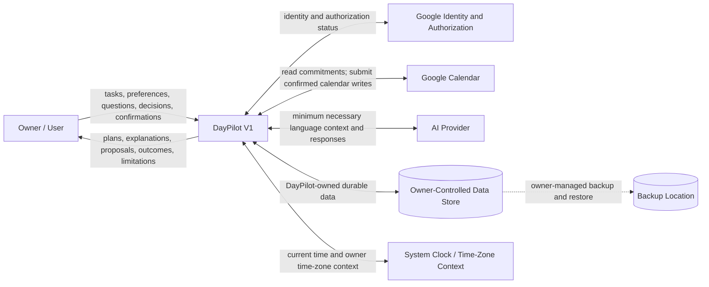

# DayPilot AI V1 System Boundaries

## Status

Approved — Phase 0 Task #7 complete.

## 1. Purpose

Explicit system boundaries identify which facts and decisions DayPilot owns, which it obtains from external authorities, and how it behaves when those authorities are unavailable or uncertain. This prevents conversation text, cached information, or AI-generated language from being mistaken for authoritative application state.

This document treats DayPilot as one conceptual system. It does not define internal modules, storage schemas, interfaces, deployment topology, or implementation technology.

## 2. V1 system context

DayPilot is an owner-controlled planning and coordination system. The owner interacts with it through a browser. DayPilot keeps personal tasks, explicit preferences, planning records, and approved conversation history in an owner-controlled data store. It uses Google for owner identity, calendar authorization, and authoritative calendar commitments. A later AI provider assists with language and presentation but does not own application state or make authoritative planning decisions. Current time and time-zone context form an environmental boundary for all temporal behavior.

The diagram shows logical relationships only. It does not imply that the owner-controlled data store, clock, or browser must be separate deployed services.

## 3. Responsibility matrix

| Capability or information | Authoritative owner or source | DayPilot responsibility | External-system or actor responsibility | Behavior when unavailable, stale, or uncertain |
| --- | --- | --- | --- | --- |
| Owner identity | Google identity for V1, interpreted by DayPilot for the single owner | Establish the current authorized owner before exposing personal data or actions | Google authenticates the account and reports identity status | Deny protected access and request reauthentication; do not guess identity |
| Calendar authorization grant | Google and the owner | Request only required access, retain necessary connection status, and honor revocation | Owner grants or revokes access; Google validates scope and token status | Stop calendar operations, preserve unrelated local task functions, and explain that authorization is required |
| Calendar commitments | Google Calendar | Retrieve, present, and use current events without treating a local copy or conversation as authoritative | Google Calendar stores events and returns authoritative current state | Mark calendar-dependent answers unavailable or stale; do not claim current availability |
| Busy intervals | Google Calendar events and busy information | Retrieve the authoritative occupied intervals needed by deterministic planning | Google Calendar reports current commitments or busy periods | Do not present a complete availability result without sufficiently current inputs |
| Personal tasks | DayPilot, based on owner input | Store task description, optional details, state, and lifecycle | Owner supplies meaning, changes, and removal decisions | Report save failure; do not claim the task was retained or changed |
| Task completion | Owner decision recorded by DayPilot | Record and present explicit completion status | Owner reports completion or reopening | Keep the prior status when an update fails; never infer completion from elapsed time |
| Explicit preferences | DayPilot, based on owner input | Store, expose, and apply the owner's current explicit preferences until the owner changes them | Owner defines or changes working hours, focus periods, buffers, default task duration, time zone, calendar selection, and planning constraints | Preserve the last confirmed value if a change cannot be saved; never silently replace it with inferred behavior |
| Current time zone | Owner's explicit DayPilot preference, with applicable civil-time rules | Use and display the relevant zone consistently and request clarification when context conflicts | Owner selects the planning zone; time-zone rules define offsets and daylight-saving transitions | Do not create a consequential proposal until ambiguity is resolved |
| Current date and time | Trusted runtime clock interpreted in the owner time zone | Use a defined evaluation instant for relative dates, deadlines, and deterministic calculations | Runtime environment supplies current time | Identify clock/time-context failure; avoid time-dependent conclusions or actions that cannot be trusted |
| Available time | DayPilot deterministic planning logic | Calculate windows from current calendar inputs, explicit preferences, buffers, and the evaluation time | Google supplies commitments; owner supplies preferences | State which dependency is missing or stale and withhold authoritative availability conclusions |
| Ranked planning suggestions | DayPilot deterministic planning logic; owner remains decision authority | Rank feasible options using known deadlines, priority, duration, availability, and preferences | AI may help phrase the result; owner accepts, rejects, or overrides it | Provide deterministic results without AI where possible; disclose incomplete inputs |
| Conversation text | Owner and DayPilot, retained for 30 days by default | Store permitted history across sessions, enforce retention, support individual or complete deletion, and prevent conversation from becoming authoritative task/calendar state | Owner supplies messages; AI provider processes only the minimum context needed for the current request | Preserve non-AI functions if history or AI is unavailable; ask the owner to restate required context |
| Proposed assistant action | DayPilot | Produce a precise, reviewable proposal with relevant conflicts and consequences | AI may interpret or phrase intent but cannot authorize the proposal | Make no external change when required information is missing or proposal generation fails |
| Confirmation or rejection | Owner | Record the decision against the current specific proposal | Owner explicitly confirms, rejects, or revises | Silence, elapsed time, or unrelated conversation is not confirmation |
| Calendar write execution result | Google Calendar | Revalidate, submit only a confirmed supported write, and report the verified outcome | Google Calendar applies or rejects the write and returns the authoritative result | Report failure or unknown outcome accurately; never claim success without confirmation |
| Local action and troubleshooting record | DayPilot | Retain minimum non-sensitive proposal, decision, outcome, timing, and correlation information needed for diagnosis | Runtime and providers supply outcome/error categories | If the record cannot be saved, disclose the limitation where it affects safe execution; do not log secrets or unnecessary personal content |
| Backup and restore | Owner-controlled backup process for DayPilot-owned data | Create restorable backups, document restoration, periodically verify recovery, and exclude or appropriately protect credentials and sensitive integration data | Owner chooses and protects the backup destination and initiates recovery | Report backup/restore failure truthfully; never treat an unverified backup as successful |

## 4. Data ownership and source-of-truth rules

1. **Google Calendar owns calendar commitments.** DayPilot may display retrieved events and retain limited operational metadata, but neither a cached event, conversation, proposal, nor AI response supersedes current Google Calendar state.
2. **DayPilot owns personal tasks and explicit preferences.** Calendar events and tasks remain separate: events commit time; tasks describe intentions or work.
3. **Explicit preferences remain authoritative until the owner changes them.** DayPilot may propose a change based on observed behavior, but it cannot silently replace working hours, focus periods, scheduling buffers, default duration, time zone, or other user-controlled planning settings.
4. **The owner owns final decisions.** Only the owner sets priorities, reports task completion, accepts commitments, and confirms consequential calendar changes.
5. **DayPilot's deterministic logic owns calculated planning results.** Available windows and ranked task-placement suggestions are derived from authoritative calendar inputs, DayPilot-owned tasks and preferences, buffers, time context, and documented rules.
6. **Recommendations are not commitments.** A suggested daily plan, task placement, or alternative time changes no authoritative state by itself.
7. **The AI provider owns no DayPilot state.** It may interpret language and help present results, but it does not authoritatively determine calendar contents, task state, availability, permissions, confirmation, or execution outcome.
8. **Conversation history is context, not truth.** Retained messages may help continue a conversation but cannot override current tasks, preferences, calendar state, or confirmation records.
9. **External writes require authoritative confirmation.** DayPilot reports a calendar write as successful only after Google Calendar confirms the current, approved operation.

## 5. Boundary interactions

### Ask for today's plan

1. The owner asks DayPilot to understand or plan the day.
2. DayPilot establishes the relevant current time and owner time zone.
3. DayPilot obtains sufficiently current commitments from Google Calendar.
4. DayPilot combines those commitments with DayPilot-owned tasks and explicit preferences.
5. Deterministic planning logic calculates availability and ranks feasible work.
6. The AI provider may help interpret the request or phrase a concise explanation using only the minimum context necessary for this request.
7. DayPilot presents commitments, tasks, available time, constraints, and recommendations as guidance for the owner.

If calendar information is unavailable or stale, DayPilot may still show clearly identified local task information but cannot present a trustworthy complete-day plan or claim current availability.

### Propose and execute a calendar write

1. The owner requests a supported change: create a new event or time block, reserve task time, or move an existing commitment.
2. DayPilot resolves material ambiguity and retrieves current authoritative calendar state.
3. Deterministic logic checks conflicts and produces an exact proposal.
4. DayPilot shows the affected commitment, proposed date/time, conflicts, consequences, and relevant alternatives.
5. The owner confirms, rejects, or revises that specific proposal.
6. After explicit confirmation, DayPilot revalidates relevant Google Calendar state.
7. If the proposal is still current, DayPilot submits the confirmed write once and obtains the authoritative result.
8. DayPilot reports verified success, verified failure, or an unknown outcome honestly and records the minimum action outcome needed for troubleshooting.

V1 does not delete calendar events or arbitrarily edit attendees, locations, descriptions, reminders, or unrelated properties.

### Handle authorization loss

When Google reports expired, invalid, insufficient, or revoked authorization, DayPilot stops affected Google operations, explains the required reconnection or permission, and keeps safe locally owned task functions available. It does not broaden scopes or infer renewed permission.

### Handle stale calendar state

DayPilot labels calendar-dependent information as stale or incomplete when freshness cannot be established. A change to relevant calendar state invalidates the corresponding proposal; the owner must review a refreshed proposal before any write.

### Handle AI-provider unavailability

DayPilot identifies that language assistance is unavailable. Deterministic task, calendar, availability, and planning capabilities remain usable through non-AI interactions where practical. DayPilot does not substitute invented intent, state, or results.

## 6. Trust boundaries and sensitive information

| Boundary | Sensitive information crossing it | Conceptual protection |
| --- | --- | --- |
| Browser ↔ DayPilot | Tasks, preferences, conversations, calendar views, proposals, confirmations, outcomes | Authenticate the owner, protect data in transit, authorize every personal-data operation, and make proposal/action states explicit |
| DayPilot ↔ Google identity | Identity assertions, authorization grants, tokens, scopes, revocation and expiry status | Request least privilege, protect credentials in storage and transit, never log token values, and honor revocation |
| DayPilot ↔ Google Calendar | Event details, busy intervals, supported confirmed writes, provider outcomes | Retrieve only required data, revalidate before writes, prevent duplicate writes, and treat provider results as authoritative |
| DayPilot ↔ AI provider | Minimum necessary selected task, calendar, preference, and conversation context; interpreted details and response text | Minimize disclosure, document data categories sent, send no credentials, retain no hidden reasoning, and validate outputs before use |
| DayPilot ↔ owner-controlled data store | Tasks, explicit preferences, permitted conversations, proposals, confirmations, outcomes, connection metadata | Limit access to the owner, minimize retained data, preserve integrity, support deletion, and protect backups |
| DayPilot ↔ diagnostics | Error categories, timing, non-sensitive correlation identifiers, dependency status | Exclude credentials and personal content by default; retain only what is necessary to diagnose failures |
| Data store ↔ backup destination | DayPilot-owned durable personal data and required recovery metadata | Owner controls destination and access; backup and restore results must be verified and reported accurately |

These are boundary-level expectations drawn from the approved non-functional requirements. A detailed threat model and concrete security controls belong to the later security/privacy review and implementation phases.

Minimum necessary context is evaluated per request. A question about tomorrow's schedule does not justify sending unrelated historical conversations, every completed task, unrelated calendar history, old planning sessions, or other personal information merely because DayPilot can access it. Hidden model reasoning and chain-of-thought are never retained as conversation history.

## 7. Failure and degradation expectations

| Condition | Expected V1 behavior |
| --- | --- |
| Google Calendar unavailable | Preserve safe local task operations; identify calendar-dependent views and calculations as unavailable; do not fabricate events, availability, or write outcomes |
| Calendar authorization expired or revoked | Stop affected reads and writes, request owner reauthorization, and retain locally owned data without treating cached calendar state as current |
| AI provider unavailable | Preserve deterministic non-AI capabilities where practical, state that language assistance is unavailable, and never invent interpreted intent or results |
| DayPilot-owned data cannot be saved | Report the failure and retain the prior known state; do not claim task, preference, confirmation, or action-record persistence succeeded |
| Calendar state changes after proposal | Invalidate or refresh the proposal, recompute conflicts, and require the owner to review and confirm the current version |
| Calendar write times out or has an ambiguous result | Do not retry blindly or claim failure/success; reconcile with authoritative state before deciding whether a safe retry is possible |
| User is offline | Make no claim that current Google data or external writes are available; expose only clearly identified local information that can be used safely |
| Current time or time-zone context missing or ambiguous | Ask the owner to establish the intended context before time-dependent recommendations or consequential proposals |
| Backup or restore fails | Report the failure and leave the previous verified data state intact where possible; do not label an unverified backup as recoverable |

In every degraded mode, DayPilot communicates the limitation and the affected capability. It does not convert uncertainty into authoritative facts or permission.

## 8. V1 external-system inventory

| System or actor | Purpose in V1 | Information exchanged | Required or optional | Authoritative responsibility | Known risks or constraints |
| --- | --- | --- | --- | --- | --- |
| Owner using a supported browser | Initiates all workflows and makes decisions | Tasks, preferences, requests, clarifications, confirmations, completion status; plans and outcomes returned | Required | Priorities, task completion, commitments, confirmation, ambiguity resolution | Silence is not consent; browser/application boundary carries sensitive personal data |
| Google identity and authorization | Establish owner identity and permit calendar access | Identity status, requested scopes, grants, tokens, expiry and revocation status | Required for protected V1 use and calendar integration | Google validates identity/grants; owner grants or revokes permission | Expiry, revocation, excessive scopes, and credential disclosure |
| Google Calendar | Supply and maintain calendar commitments; execute supported confirmed writes | Events, busy intervals, supported new/moved commitments, execution outcomes | Required for calendar-dependent V1 capabilities | Current calendar commitments and calendar-write outcome | Provider latency/outage, external concurrent changes, quotas, recurrence/time-zone complexity, stale reads |
| AI provider | Assist later with language interpretation, structured detail extraction, clarification wording, explanations, and conversation | Minimum necessary selected context and generated/interpreted language | Required for full conversational V1; optional for deterministic degraded operation | Its own service response only; no DayPilot application state | Privacy disclosure, probabilistic errors, latency, outage, changing provider behavior |
| Owner-controlled data store | Persist DayPilot-owned data | Tasks, preferences, permitted conversation history, proposals, decisions, outcomes, minimal connection metadata | Required | Durable DayPilot task/preference/action state | Local loss, corruption, unauthorized access, retention growth, failed writes |
| System clock and time-zone rules | Supply evaluation time and civil-time interpretation | Current instant, owner zone, offsets, daylight-saving rules | Required for time-dependent behavior | Current runtime time signal and applicable time-zone rules | Misconfigured clock, missing zone, ambiguous relative dates, daylight-saving transitions |
| Owner-controlled backup location/process | Preserve and restore DayPilot-owned durable data | Restorable backup, protected or excluded credentials, and verified recovery result | Required before V1 is ready for regular personal use | Stored backup artifact under owner control | Stale/unverified backup, credential disclosure, incomplete restore, destination availability |

## 9. Explicitly excluded systems

The detailed rationale and long-term classification remain in [V1 scope boundaries](v1-scope.md). Task #7 does not design these integrations.

Deferred from V1 include non-Google calendar providers, Gmail and other email services, contacts, voice platforms, native mobile applications, externally authorized booking or calling services, traffic/location providers, family or shared-planning services, third-party task managers, billing/subscription services, and public identity or tenant-management infrastructure.

Smart-home control, team project-management systems, employee monitoring, and fully autonomous scheduling remain outside the current product direction.

## 10. Open questions

No unresolved product-owner decision remains for the V1 system boundary. Deployment topology, detailed authorization flow, storage design, and internal application decomposition belong to later tasks.
